# EngageX — Adaptive Mastery & Engagement Platform


> **Turn passive video watching into active mastery.**

---

## 🚀 Overview

**EngageX** is a sci-fi themed learning platform that transforms standard educational YouTube videos into interactive "Learning Missions."

Most online learning is passive—users watch a video and forget 80% of it within hours. EngageX solves this by wrapping the YouTube player in a "Command Deck" interface. It uses **Google Gemini 2.5** to analyze video content in real-time, generating mission objectives, tactical briefings, and active recall checkpoints.

### ✨ Key Features

* **🕵️‍♂️ AI Mission Generation:** Automatically extracts learning objectives and creates a "Mission Briefing" from any YouTube video URL.
* **🎮 Gamified Mastery:** Earn XP, level up your "Cadet" rank, and unlock skills on a visual Skill Tree.
* **🧠 Active Recall:** The video player intelligently pauses to challenge the user with concept-checking questions.
* **🌌 Immersive UI:** A fully responsive "Glassmorphism" interface designed to induce flow state.
* **🔐 Secure Auth:** Integrated Firebase Authentication (Google & Email/Password).

---

## 🏗️ System Architecture

The following flow illustrates how EngageX processes a video into a learning mission:

```mermaid
graph TD
    User[👩‍🚀 Cadet] -->|Pastes URL| App[EngageX App]
    App -->|Fetch Metadata| YT[YouTube Data API]
    YT -->|Title, Desc, Duration| App
    App -->|Send Context| AI[Google Gemini API]
    AI -->|Generate Briefing & Objectives| App
    App -->|Render Mission| UI[Mission Control UI]
    User -->|Watch & Complete| UI
    UI -->|Save Progress| DB[(Firebase Firestore)]

```



---

## 🛠️ Tech Stack

* **Frontend:** React 19 (Hooks, Context API), TypeScript
* **Build Tool:** Vite
* **Styling:** Tailwind CSS v4, Framer Motion (Animations), Lucide React (Icons)
* **Backend / Serverless:** Firebase (Authentication, Firestore Database)
* **AI Engine:** Google Gemini API (`@google/genai` SDK)
* **Video Integration:** YouTube Data API v3

---

## ⚙️ Getting Started

Follow these instructions to set up the project locally.

### 1. Clone the Repository

```bash
git clone https://github.com/mr-mk47/engagex.git
cd engagex

```

### 2. Install Dependencies

```bash
npm install

```

### 3. Environment Configuration

You need API keys for both Google Gemini (for AI features) and YouTube Data API (for video metadata).

1. Create a `.env` file in the root directory.
2. Add the following keys:

```env
# Google AI Studio (Gemini)
VITE_GEMINI_API_KEY=your_gemini_api_key_here

# YouTube Data API v3
VITE_YOUTUBE_API_KEY=your_youtube_api_key_here

```

> **Note:** The Firebase configuration is initialized in `src/lib/firebase.ts`. For a production deployment, replace the config object with your own Firebase project credentials.

### 4. Run Development Server

```bash
npm run dev

```

Visit `http://localhost:5173` to launch the application.

---

## 📸 Screenshots

| Entry Portal | Command Deck |
| --- | --- |
|  |  |

| Mission Briefing | Skill Tree |
| --- | --- |
|  |  |

---

## 🤝 Contributing

This project is open for hackathon collaboration!

1. Fork the Project
2. Create your Feature Branch (`git checkout -b feature/AmazingFeature`)
3. Commit your Changes (`git commit -m 'Add some AmazingFeature'`)
4. Push to the Branch (`git push origin feature/AmazingFeature`)
5. Open a Pull Request

---

## 📜 License

Distributed under the **MIT License**. See `LICENSE` for more information.

---

<div align="center">
<p>Built with ❤️ and ☕ by Team Apex Fusion</p>

</div>
